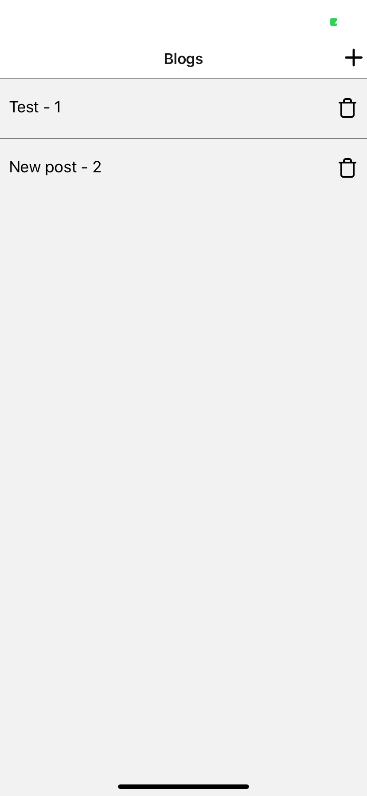
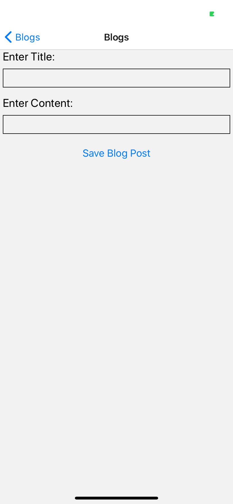

# Blog
Working blog App that uses local database jsonServer
## Summary
React Native Blog App used to creat, edit, and delete blogs 

## Usage

When you open the application you will start on the landing page below:

See blog streem and add, edit, or delete your own!

## Architecture 

A blogging app that uses React Native

## About

Blogging App to create, edit, and delete blog posts.

## Running locally
Steps to run:
- download the Expo app on your mobile device
- this app also requires you do download the localServer git repository from my directory
- open three terminals two for localServer and one for blog
- in the two localServer terminal windows "npm run db" and in the other "npm run tunnel"
- in the blog terminal
- npm install
- npm start
- A web browser will open in which you can then scan the code that pops up with your phones camra.

